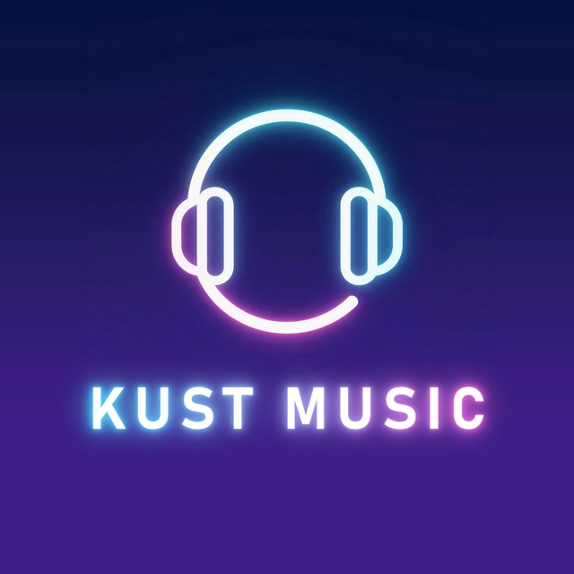

# KustMusic

A Telegram music bot that plays songs into group voice chats. It is one program: the bot, the playback engine and the downloader all run in a single process, so there is no separate playback API to host. Songs are found and downloaded with [yt-dlp](https://github.com/yt-dlp/yt-dlp).

<p align="center">
  
</p>

## Features

- Play from YouTube by name or link
- Player card with a live progress bar and Skip, Pause, Resume and Stop buttons
- Queue, skip, clear, and a pre-download of the next queued song
- Personal playlists (needs MongoDB)
- Group tools: ban, unban, kick, mute, unmute and timed mute
- `/clone`: anyone can run their own copy of the bot from a BotFather token (needs MongoDB and a webhook)
- Works behind a webhook, or with plain polling when you have no public address
- No secrets or private services baked in. Everything comes from environment variables

## How it works

```
Telegram ──▶ bot (Bot API, webhook or polling)
                 │  HTTP on 127.0.0.1 only
                 ▼
            playback engine ──▶ yt-dlp (search + download) ──▶ cache on disk
                 │
                 ▼
            assistant account (MTProto + NTgCalls) ──▶ the group's voice chat
```

Voice chats cannot be joined by bots, so a normal Telegram **user account** (the "assistant") joins and streams the audio. The bot only takes commands.

## What you need

| Thing | Where to get it |
|---|---|
| `BOT_TOKEN` | [@BotFather](https://t.me/BotFather) |
| `API_ID`, `API_HASH` | [my.telegram.org](https://my.telegram.org) → API development tools |
| `ASSISTANT_SESSION` | A Pyrogram (Kurigram) session string for a spare Telegram account. See below |
| Docker | To build and run it. The voice library is native Linux code, so it is built inside the image |

Optional: `MONGO_URI` (playlists, broadcast, `/clone`), `OWNER_ID` (owner commands), `WEBHOOK_URL`, and YouTube cookies.

### Getting the assistant session string

Use a separate account, not your main one. Anyone holding the string has full access to that account.

```bash
pip install kurigram
python - <<'EOF'
from pyrogram import Client
with Client("assistant", api_id=YOUR_API_ID, api_hash="YOUR_API_HASH", in_memory=True) as app:
    print(app.export_session_string())
EOF
```

It asks for the account's phone number and the login code. **Run one session string in one place at a time.** If two programs use it at once Telegram revokes it.

## Run it

```bash
git clone https://github.com/kustbots/kustmusic
cd kustmusic
cp .env.example .env      # fill in BOT_TOKEN, API_ID, API_HASH, ASSISTANT_SESSION
docker compose up --build
```

With `WEBHOOK_URL` empty the bot polls Telegram, which is the simplest way to run at home or on a VPS. With a public HTTPS address set `WEBHOOK_URL=https://your-host/webhook`.

### Heroku (container stack)

```bash
heroku create
heroku stack:set container
heroku config:set BOT_TOKEN=... API_ID=... API_HASH=... ASSISTANT_SESSION=... \
  WEBHOOK_URL=https://YOUR-APP.herokuapp.com/webhook
git push heroku main
```

## YouTube cookies

YouTube often refuses downloads from server addresses and answers "sign in to confirm you're not a bot". Export your cookies in Netscape format (a browser extension such as "Get cookies.txt LOCALLY" does it) and give them to the bot either way:

- `COOKIES` — the file's text as an environment variable. Preferred, because nothing has to be stored in the image.
- `COOKIES_FILE` — a path to the file, for example one mounted into the container.

Use a throwaway Google account. **Never commit cookies.** `.gitignore` already skips `cookies*`.

## Settings

All settings are environment variables. See [`.env.example`](.env.example) for the full list. The ones you are most likely to change:

| Variable | Default | Meaning |
|---|---|---|
| `BOT_TOKEN`, `API_ID`, `API_HASH`, `ASSISTANT_SESSION` | required | See above |
| `OWNER_ID` | none | Your Telegram user id. Enables owner-only commands |
| `WEBHOOK_URL` | empty | Public `https://.../webhook`. Empty means polling |
| `PORT` | `8000` | Port the bot listens on |
| `MONGO_URI`, `MONGO_DB` | none, `kustmusic` | Turns on playlists, premium users, broadcast and `/clone` |
| `COOKIES`, `COOKIES_FILE` | none | YouTube cookies |
| `YTDLP_ARGS` | none | Extra yt-dlp flags, for example `--proxy http://host:port` |
| `CACHE_MAX_MB` | `512` | Downloaded audio kept on disk before the oldest is deleted |
| `IDLE_GROUP_LEAVE_SECONDS` | `259200` | The assistant leaves a group with no plays for this long. `0` never leaves |
| `ASSISTANT_NAME` | none | Display name set on the assistant account. Empty leaves it alone |
| `COMMUNITY_URL`, `SUPPORT_URL`, `UPDATES_URL`, `GITHUB_URL`, `SUPPORT_USERNAME` | project defaults | Links behind the bot's buttons |
| `PROMO_ENABLED` | off | `true` lets the bot post an occasional "add me to your group" note |

## Commands

**Everyone:** `/play <name or link>`, `/queue`, `/skip`, `/pause`, `/resume`, `/stop`, `/clear`, `/playlist`, `/ping`, `/help`, `/start`, `/clone <bot token>`, `/unclone <bot token>`

**Group admins:** `/ban`, `/unban`, `/kick`, `/mute`, `/unmute`, `/tmute <minutes>`, and `/skip`, `/pause`, `/resume`, `/stop` when the group limits them

**Owner:** `/broadcast`, `/bstatus`, `/bcancel`, `/live`, `/clones`, `/resetclones`, `/prime`

## Clone bots

`/clone <token>`, sent in a private chat, runs a copy of the bot under a bot of the user's own:

1. The bot checks the token with Telegram and points that bot's webhook at `/clone/<token>`.
2. The token is saved in MongoDB (`clone_bots`), so webhooks can be restored later.
3. `/resetclones` (owner) re-registers every saved webhook, for example after the app moves to a new address.

This needs `MONGO_URI` and `WEBHOOK_URL`. Each user can have 5 clones. Note that the token is part of the webhook path, so a host that logs request paths will log tokens. Keep your logs private.

## Layout

```
main.go, *.go          the bot: commands, queue, UI, clone bots
internal/telegram      small Bot API client
internal/playrouter    talks to the playback engine
internal/playapi       the playback engine's HTTP API, idle sweeper, voice layer
internal/core/ytdlp    search and download through yt-dlp
internal/core/playback download, verify, play, confirm sound
internal/core/vc       assistant account + NTgCalls (native, Linux only)
internal/store         MongoDB
```

## Development

```bash
go test ./internal/core/ytdlp ./internal/ytapi    # runs anywhere, no yt-dlp needed
go vet ./...
docker build .                                    # the only way to build the voice library
```

The voice layer needs the NTgCalls native library, which the Dockerfile downloads at build time, so a plain `go build ./...` only works on Linux with that library in place.

## Limits

- One assistant account, so one voice chat per group and the account's own Telegram limits apply
- Audio only. There is no video playback
- Sources are whatever yt-dlp can read; results depend on YouTube allowing the download

## License

MIT. See [LICENSE](LICENSE).
